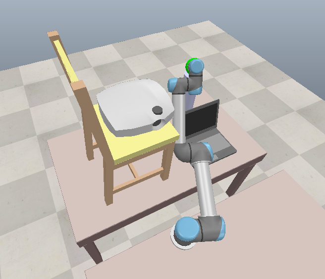
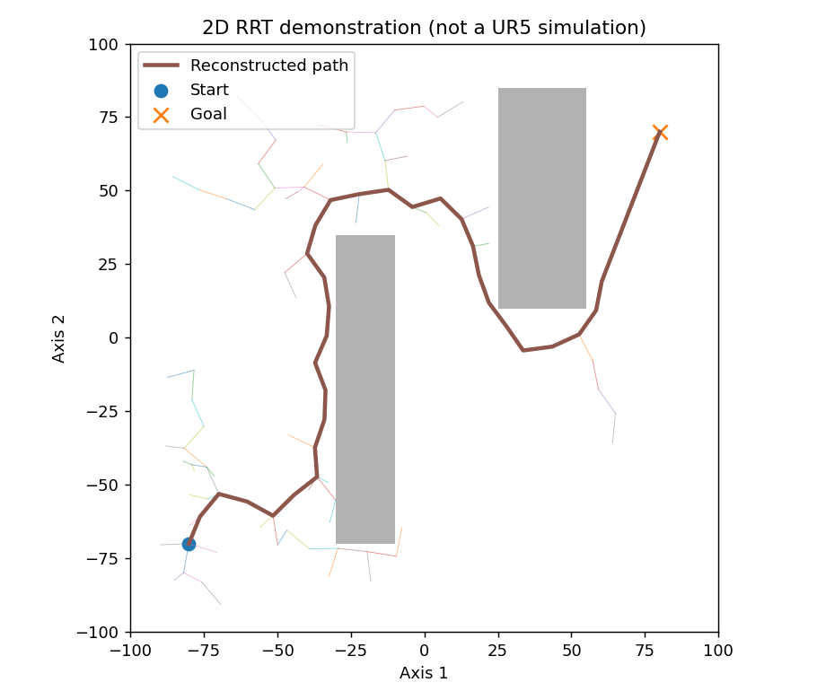

# Robot Arm Motion Planning

Motion planning for a UR5 robot in CoppeliaSim. The robot finds a path around obstacles, reaches a green target, and returns to its starting pose.

[](https://youtu.be/wQspVbpZ7rY)

[Robot demo](https://youtu.be/wQspVbpZ7rY) | [RRT planning demo](https://youtu.be/gnm1zqYfLEw)

## How it works

- Inverse kinematics finds joint angles for the target.
- Collision checks reject blocked configurations and path segments.
- Bidirectional RRT-Connect searches for a route when the direct path is blocked.
- Cubic interpolation makes movement between waypoints smooth.



*Standalone 2D example showing how RRT explores around obstacles. The UR5 demo plans in six-dimensional joint space.*

## Run

Requires Python 3.11+ and CoppeliaSim. Tested with CoppeliaSim 4.10 EDU on Windows.

```powershell
py -m pip install -r requirements.txt
py -m pytest -q
```

Open `scenes/UR5ObstacleDemo.ttt` in CoppeliaSim and leave the simulation stopped. Run from the project folder:

```powershell
py -m src.touch_goal check
py -m src.touch_goal plan
py -m src.touch_goal play
```

`check` finds a clear goal pose. `plan` saves a collision-checked route to `output/touch_goal_path.json`. `play` checks it again before moving. Replan if you change the scene.

To plot joint motion from the saved path:

```powershell
py -m src.plot_touch_path
```

To run the separate 2D RRT example:

```powershell
py -m src.demo_rrt
```

## Notes

This is offline planning followed by kinematic playback, not real-time replanning. Collision checks use the simulator's configured collision geometry. Contact forces are not simulated.

The project started as university robotics coursework and was later cleaned up and extended with the obstacle scene and target-reaching demo.
